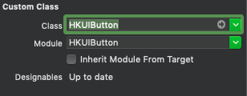

#  HKUIButton # 
     
#### Harrison Kong's Enhanced UIButton ####


## VERSION HISTORY ##

1.0.0 - 2020/01/18 - Initial release

1.0.1 - 2020/02/05 - Minor bug fixes

## MINIMUM REQUIREMENTS ##

**Swift** 4.0 or above

**iOS** 11.0 or above


## WHAT IS IT? ##
`HKUIButton` enhances the functionality of UIButton by providing these additional features:

### Dynamic Corner Radius 
Allows you to dynamically calculate the corner radius base on one of the followings:

- the width of the label
- the height of the label
- the length of the shorter edge of the label (width or height)
- the length of the longer edge of the label (width or height)

- Or, it can also be set to a constant

This is useful for labels that change size (e.g. device rotation) or for catering to screen sizes of different devices (e.g., iPhone vs. iPad)

### Dynamic Font Scaling ###

Allows you to dynamically calculate the font size base on one of the followings:

- the width of the label
- the height of the label
- the length of the shorter edge of the label (width or height)
- the length of the longer edge of the label (width or height)

This is useful for labels that change size (e.g. device rotation) or for catering to screen sizes of different devices (e.g., iPhone vs. iPad)

The following examples show how this work. The top button has dynamic corner radius and dynamic font scaling turned on and the bottom button does not. The first screen is an iPhone, the second screen is an iPad. As you can see, the fixed sizes do not look right on the second screen.

 

### Border Customization
It also let users customize the border width, color and alpha value for both normal, highlighted and disabled states.


## HOW TO INSTALL IT ##

Use one of the following methods:

### 1. Using CocoaPod ###

The module is avabilable via CocoaPods Trunk. Below is an example podfile. If you already use a podfile for your project, all you have to do is add the line that specifies `HKUIButton`. The other dependencies will also be automatically installed in the xcworkspace.

```
platform :ios, '11.0'

target 'MyTarget' do

  use_frameworks!

  pod 'HKUIButton', '~> 1.0.0'
  # other pods for your project

end

# This post_install section fixes a bug in CocoaPod that does not allow
# IBDesignables to render in interface builder

post_install do |installer|
installer.pods_project.targets.each do |target|
    target.new_shell_script_build_phase.shell_script = "mkdir -p $PODS_CONFIGURATION_BUILD_DIR/#{target.name}"
        target.build_configurations.each do |config|
            config.build_settings['CONFIGURATION_BUILD_DIR'] = '$PODS_CONFIGURATION_BUILD_DIR'
            config.build_settings.delete('CODE_SIGNING_ALLOWED')
            config.build_settings.delete('CODE_SIGNING_REQUIRED')
        end
    end
end
```

#### ***** IMPORTANT!! ***** ####

If you are installing this as a CocoaPod, you **MUST** include this script at the end of your Podfile or the Inspectables won't work in Interface Builder. However, if you don't, it will still function as expected at runtime. There is no need to include this if you do are not using Interface Builder.

```
# This post_install section fixes a bug in CocoaPod that does not allow
# IBDesignables to render in interface builder

post_install do |installer|
    installer.pods_project.targets.each do |target|
        target.new_shell_script_build_phase.shell_script = "mkdir -p $PODS_CONFIGURATION_BUILD_DIR/#{target.name}"
        target.build_configurations.each do |config|
            config.build_settings['CONFIGURATION_BUILD_DIR'] = '$PODS_CONFIGURATION_BUILD_DIR'
            config.build_settings.delete('CODE_SIGNING_ALLOWED')
            config.build_settings.delete('CODE_SIGNING_REQUIRED')
        end
    end
end
```

Don't forget to import the module in your source code:

```
import HKUIImageView
```

### 2. BY INCLUDING THE SOURCE FILES ###

You can also simply include the following source files in your project:

```
HKUIButton.swift
UIView+HKAutoCornerRounding.swift
UIView+LengthCalculationBasis.swift
```


## HOW TO USE IT ##

### Interface Builder ###

1. Drop a UIImageView in your view controller then change the class in the *Identity Inspector* pane to HKUIImageView like this:



Note that you might need to wait for the design time code to compile after setting the class.

2. There will be 28 inspectable variables at the *Attribute Inspector* pane:


  - the 1st one **Auto Corner Rounding** is an on/off switch to control whether automatic corner radius calculation will be enabled.
  - the 2nd attribute **Corner Rounding Basis** is an integer that corresponds to the following:

        1 = width of the label
        2 = height of the label
        3 = shorter edge (width or height) of the label
        4 = longer edge (width of height) of the label
        5 = no calculation, set to a constant
        
        If this is set to any number less than 1, it will be assumed to be 1
        If this is set to any number greater than 5, it will be assumed to be 5
        
  - the 3rd atrribute is **Corner Radius Constant** which is a CGFloat. This is only used if the previous attribute is 5 (constant).
  - the 4th attribute is **Corner Radius Factor** which is a CGFloat that is used to divide the chosen length in the 2nd attribute to be set as the font size. For example, if this is set to 24 and the previous attribute is 2 = height, the font size will be set to the height of the label divided by 24. Experiment to get the desired result. This attribute is not used if the 2nd attribute is set to 5 (constant).
  
  - The 5th attribute is **Auto Size Title Font**. is an on/off switch to control whether dynamic font sizing will be enabled.
  
  - The 6th attribute **Auto Size Title Font Basis** is an integer that corresponds to the following:
  
        1 = width of the label
        2 = height of the label
        3 = shorter edge (width or height) of the label
        4 = longer edge (width of height) of the label
        
        If this is set to any number less than 1, it will be assumed to be 1
        If this is set to any number greater than 4, it will be assumed to be 4

  - the 7th attribute is **Auto Size Title Font Factor** which is a CGFloat that is used to divide the chosen length in the 2nd attribute to be set as the font size. For example, if this is set to 24 and the previous attribute is 2 = height, the font size will be set to the height of the label divided by 24. Experiment to get the desired result. This attribute is not used if the 2nd attribute is set to 5 (constant).
  
  - The 8th, 9th and 10th attributes are **Border Color**, **Border Alpha**, and **Border Width**. Which are self explanatory.
  
  - The 11th, 12th, 13th and 14th attribute are **Normal Bkg**, **Normal Bkg Alpha**, **Normal Text**, **Normal Text Alpha**. Which are the normal background color, normal background alpha, normal text color and normal text alpha, respectively.


  - The 15th, 16th, 17th, and 18th attributes are **Hilite Bd Color**, **Hilite Bd Alpha**, and **Hilite Bd Width**. Which are the highlighted border color, hightlighted border alpha, and hightlighted border width, respectively.
  
  - The 19th, 20th and 21st attributes are **Hilite Bkg**, **Hilite Bkg Alpha**, **Hilite Text**. Which are the hightlighted background color, hightlighted alpha, and highlighted text color, respectively.
  
  - The 22nd - 24th attributes are **Disabled Bd Color**, **Disabled Bd Alpha**, and **Disabled Bd Width**. Which are the disabled border color, disabled border alpha, and disabled border width, respectively.
  
  - The 25th and 26th attributes are **Disabled Bkg** and **Disabled Bkg Alpha**. Which are the disabled background color and disabled background alpha, respectively.
  
  - The 27th and 28th attributes are **Disabled Text** and **Disabled Text Alpha**. Which are the disabled text color and disabled text alpha, respectively.
    
3. Of course, the immediate appearance of the label might differ from the one at runtime if the label size changes.

### Programmatically ###

Create an instance of the class and then set the attributes (see Interface Builder above for explanations of the attributes)

```
let myButton = HKUIButton()

myButton.autoCornerRounding = true
myButton.roundingBasis = .height
myButton.cornerRadiusConstant = 0.0  // not used here, only used if roundingBasis is .constant
myButton.cornerRadiusFactor = 24.0

myButton.autoSizeTitleFont = true
myButton.titleFontBasis = .height
myButton.autoSizeTitleFontFactor = 2.7

myButton.borderColor = UIColor.red
myButton.borderAlpha = 1.0
myButton.borderWidth = 5.0

myButton.normalBkg = UIColor.yellow
myButton.normalBkgAlpha = 1.0
myButton.normalText = UIColor.blue
myButton.normalTextAlpha = 1.0

myButton.hiliteBdColor = UIColor.yellow
myButton.hiliteBdAlpha = 1.0
myButton.hiliteBdWidth = 5.0

myButton.hiliteBkg = UIColor.blue
myButton.hiliteBkgAlpha = 0.5

myButton.hiliteText = UIColor.yellow
myButton.hiliteTextAlpha = 1.0

myButton.disabledBdColor = UIColor.gray
myButton.disabledBdAlpha = 0.5
myButton.disabledBdWidth = 5.0

myButton.disabledBkgColor = UIColor.black
myButton.disabledBkgAlpha = 0.7
myButton.disabledText = UIColor.gray
myButton.disabledTextAlpha = 0.7

```

Note that the attributes `roundingBasis` and `titleFontBasis` are of enumeration type that is declared in `UIView+LengthCalculationBasis.swift` as follow:

```
@objc public enum LengthCalculationBasis: Int {
   case width = 1
   case height
   case shorterEdge
   case longerEdge
   case constant
}
```


## KNOWN ISSUES ##

There are no known issues currently.

